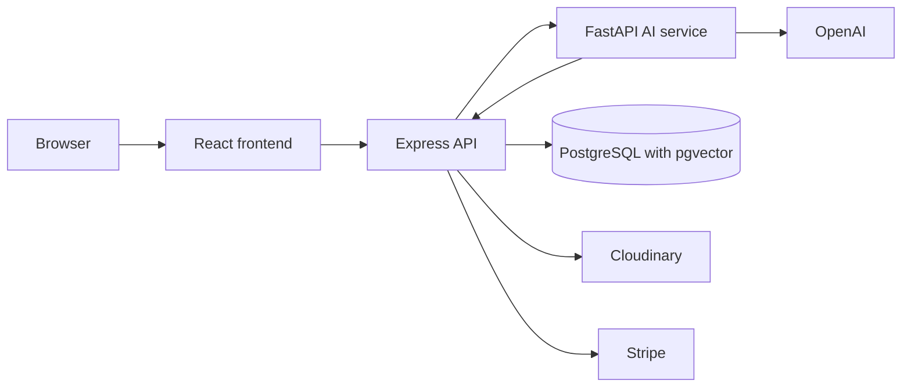

# NovaTrend

NovaTrend is a full-stack store: a React storefront, an Express and Prisma API, and a FastAPI assistant. Customers browse products, use a server-side cart, check out, and ask about products, orders, and store policies. Admins manage the catalog, orders, users, and AI activity.

Prices are USD.

## Features

### Customer

- Email registration and sign-in, plus Google sign-in when OAuth is configured
- Product search, filters, pagination, and product details
- Server-side cart, checkout, and shipping details
- Wishlist stored in browser `localStorage`
- Cash on delivery, and Stripe Checkout when payment keys are set
- Order history, details, and cancellation
- Streaming assistant at `/assistant`, with saved conversation history
- In-chat approval before the assistant can cancel an order

### Admin

- Dashboard counts for users, products, orders, and sales
- Products, categories, and Cloudinary image upload
- Order list, details, and status updates
- User role and active-status changes
- AI activity for recent requests, approvals, and the latest evaluation run

### Assistant

- Product search, details, stock, and similar products
- Order status and items for the signed-in customer only
- Policy answers from the indexed knowledge base
- Support tickets stored in PostgreSQL

## Architecture



The storefront talks only to the Express API. The AI service does not own products or orders. It calls `/api/internal` with `x-internal-api-key`.

Docker Compose also starts Redis and a Celery worker. No Celery tasks are registered. Order email uses SMTP when configured; otherwise the API logs the message.

Main API groups, implemented in `backend/src/routes/`:

- `/api/auth` and `POST /api/refresh`
- `/api/products` and `/api/categories` for the public catalog
- `/api/cart`, `/api/orders`, and `/api/payments`
- `/api/ai` for conversations, streaming chat, support, and approvals
- `/api/admin` and `POST /api/upload/image`
- `/api/internal` for the AI service only

## AI, RAG, and memory

The customer UI streams through `POST /api/ai/chat/stream`. The API checks that the conversation belongs to the user and proxies the request to one assistant in `app/agent_stream.py`, which can call store tools. A separate orchestrator in `app/orchestrator.py` classifies a message as commerce, support, or knowledge. The customer stream does not use that orchestrator. `POST /api/ai/chat` and `python evals/run_eval.py` do.

Policy PDFs in `ai-service/data/knowledge/` are chunked, embedded, and stored in PostgreSQL with pgvector. A question is embedded the same way, and the closest chunks are retrieved for the answer. Product similarity uses a separate product embedding index. Catalog text search is not vector search. Both indexes stay empty until the index scripts have been run.

Memory is conversation history in PostgreSQL, not a vector store:

- Each conversation and its messages belong to one user.
- The stream sends recent messages with the new question.
- `POST /api/ai/chat` and `POST /api/ai/support` do not load that history.

`cancel_order` only creates a pending approval. The customer confirms or rejects it in the chat.

## Security

Access tokens are short-lived JWTs. Refresh tokens are random values stored as SHA-256 hashes. Passwords use bcrypt. Login is rate limited. Helmet and CORS protect the API. Cart, orders, payments, conversations, and approvals are scoped to the signed-in user. Admin routes require an admin role. Internal routes require `x-internal-api-key`. Order creation checks stock in a transaction. `JWT_REFRESH_SECRET` is listed in the example env files, and the token code does not read it.

## Tech stack

- **Frontend:** React 19, Vite 8, React Router 7, TanStack Query 5, Axios, React Hook Form, Zod, Tailwind CSS 4
- **Backend:** Node.js 24, Express 5, Prisma 7, PostgreSQL 15 with pgvector, JWT, bcrypt, Cloudinary, Stripe, Nodemailer
- **AI service:** Python 3.12, FastAPI, Uvicorn, OpenAI Responses API and embeddings, pypdf, httpx, Celery, and Redis

## Docker

| Service | Image / build | Host port |
| --- | --- | --- |
| `postgres` | `pgvector/pgvector:pg15` | `5432` |
| `backend` | `./backend` | `5000` |
| `frontend` | `./frontend` (nginx) | `5175` |
| `ai-service` | `./ai-service` | `8001` |
| `ai-worker` | `./ai-service`, Celery command | none |
| `redis` | `redis:7-alpine` | `6379` |

Create `backend/.env` and `ai-service/.env` first. Compose overrides some backend values, including `DATABASE_URL`. Replace inline secrets in `docker-compose.yml` before sharing it. The backend image does not run migrations on startup.

```bash
docker compose up --build
```

Open `http://localhost:5175`. Apply migrations and seed against `localhost:5432`, or run Prisma inside the backend container.

## Local setup

Prerequisites: Node.js 24, Python 3.12, PostgreSQL 15 with pgvector (or Docker), Cloudinary for admin uploads, and an OpenAI key for the assistant.

Copy the example env files and fill them in. Do not commit `.env` files.

- `backend/.env.example`: `DATABASE_URL`, `JWT_SECRET`, `JWT_EXPIRES_IN`, `FRONTEND_URL`, Cloudinary, Stripe (`PAYMENT_PROVIDER_KEY`, `PAYMENT_WEBHOOK_SECRET`), `INTERNAL_API_KEY`, `AI_SERVICE_URL`, and optional Google keys. Optional email vars, not in the example file: `EMAIL_HOST`, `EMAIL_PORT`, `EMAIL_USER`, `EMAIL_PASSWORD`, `EMAIL_FROM`. Optional `ALLOWED_ORIGINS`.
- `frontend/.env.example`: `VITE_API_URL`, `VITE_GOOGLE_CLIENT_ID`. Local API URL is `http://localhost:5000/api`. The Docker build uses `/api`.
- `ai-service/.env.example`: `COMMERCE_API_URL`, `INTERNAL_API_KEY` (must match the API), `OPENAI_API_KEY`, `OPENAI_MODEL`, `OPENAI_EMBEDDING_MODEL`, and Redis/Celery URLs. Inside Compose, `COMMERCE_API_URL` is `http://backend:5000/api/internal`.

`OPENAI_MODEL` in the example file is `gpt-5.6-luna`. Set it to a model your account can call.

```bash
cd backend
npm install
npx prisma migrate dev
npx prisma generate
npm run db:seed
npm run dev
```

The API listens on port `5000`. `GET /health` and `GET /api/health` report status. `npm run db:seed` creates `admin@example.com` with the password in `backend/prisma/seed.js`, plus Electronics and Fashion categories and three sample products. That password is for local use only.

```bash
cd frontend
npm install
npm run dev
```

Vite serves `http://localhost:5173`.

```bash
cd ai-service
pip install -r requirements.txt
uvicorn app.main:app --host 0.0.0.0 --port 8001
python scripts/index_knowledge.py
python scripts/index_products.py
```

## Project structure

```
ecommerce-project/
├── frontend/            React storefront, Dockerfile, nginx.conf
├── backend/             Express API, Prisma, Vitest tests
├── ai-service/          FastAPI assistant, agents, RAG, evals, index scripts
├── infra/ecs/           ECS task definition templates
├── .github/workflows/   CI and ECS deploy workflow
└── docker-compose.yml
```

## Testing

```bash
cd backend && npm test
cd frontend && npm run lint && npm run build
cd ai-service && python evals/run_eval.py
bash scripts/smoke-test.sh http://localhost:5000
python scripts/ai-smoke-test.py http://localhost:8001/api/ai/knowledge
```

Backend Vitest covers auth, cart, orders, admin order updates, payments, and notification emails. Tests mock Prisma. The frontend has no test script. The eval script calls the orchestrator and needs an OpenAI key plus a running API with indexed data.

## Current status

- Storefront, API, database, and assistant run locally as described above.
- Policy RAG and similar-product search stay empty until the index scripts have run.
- Compose starts the Celery worker, and no task is registered.
- Email is logged unless `EMAIL_HOST`, `EMAIL_USER`, and `EMAIL_PASSWORD` are set.
- Stripe Checkout needs `PAYMENT_PROVIDER_KEY` and `PAYMENT_WEBHOOK_SECRET`. Cash on delivery does not.
- Google sign-in is skipped when `VITE_GOOGLE_CLIENT_ID` is empty.
- `.github/workflows/deploy.yml` pushes images to Amazon ECR and updates ECS services in the `novatrend-prod` cluster. It needs repository secrets. This repository does not document a public production URL.
- There is no `LICENSE` file.
